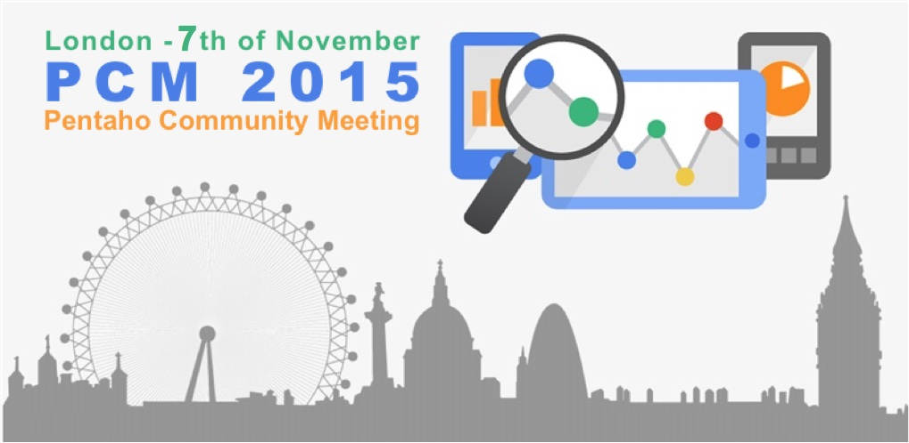
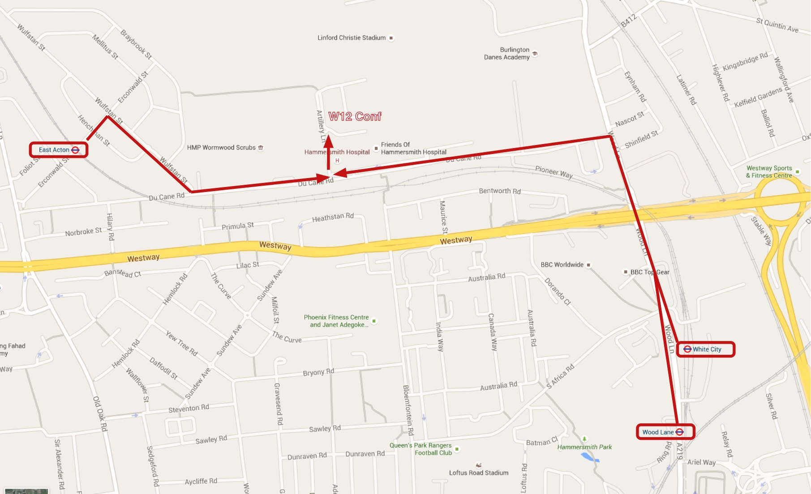
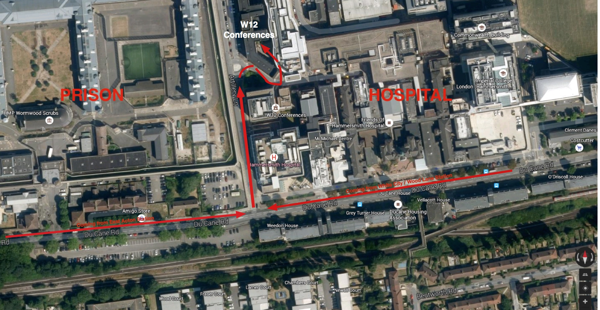

# Pentaho Community Meetup 2015

This page holds all the essential info about the Pentaho Community Meetup 2015.

Most important bits first:

- **Location**: **London**
- **Date**: **November 7th** - there will also be a Hackathon on Friday evening and social activities on Sunday.
- **Venue**: [W12 Conferences](http://www.w12conferences.co.uk/index), West London

## Registration 

Attending the presentations and hackathon is completely **free**!

Please register for the **main event** [here](https://www.eventbrite.com/e/pentaho-community-meeting-tickets-16994065708) for a free ticket.

For the **hackathon** on Friday evening please register [here](http://www.meetup.com/Pentaho-London-User-Group/events/222548597/). 

## Costs

- As with previous PCM meetups there will be a nominal charge to cover lunch on Saturday.

## Agenda

Rough outline, details TBC:

- **Friday**: Evening [Hackathon](http://www.meetup.com/Pentaho-London-User-Group/events/222548597/) in the city with fancy prizes to be won, then drinks!
- **Saturday**: 2 streams of talks - Business and Tech focussed
- **Saturday Evening** Dinner/drinks around [soho](http://en.wikipedia.org/wiki/Soho)
- **Sunday**: Social activities (e.g. sightseeing)

## How to submit the talks

Please send details to pentaho.community.meetup.2015@gmail.com. 

Provide the following:

- Your full name
- Links to your profie and company
- Title of the talk and synopsis

# Friday: Venue Info, Agenda Etc

## Venue Location

Near **Liverpool Street Station**, details TBC

## How to Get There

TBC

# Saturday: Venue Info, Agenda Etc

## Venue Location

[W12 Conferences](http://www.w12conferences.co.uk/index), West London.

**Address**:

W12 Conferences,
Artillery Lane,
150 Du Cane Road,
London,
W12 0HS

## How to Get There

Please visit [Transport for London](www.tfl.gov.uk) for best directions from your London location to W12 Conferences.

**Nearest tube stations** 

- **Central Line**: **White City** and **East Acton** both within a 10 minute walk.
- **Hammersmith & City** and **Circle Lines**: **Wood Lane** within a 12 min walk

**Buses**
Buses 7, 70, 72, 272 & 283 bus routes stop directly outside on Du Cane Road.  When getting off the bus, look for Queen Charlottes hospital, to your left when looking at Hammersmith Hospital.  Artillery Lane is the road running past this towards the car park.  Follow this road and turn right at the mini roundabout, then turn left directly into the W12 courtyard, our reception is here.

**Nearest Mainline Train stations**
Paddington Station - 10 mins
Take Hammersmith & City or Circle line to Wood Lane Tube station
 
**Liverpool Street** – 25 mins
Take Central Line to White City station
 
**Victoria Station** – 22 mins
Take Victoria Line to Oxford Circus. Change to Central Line to White City station.
 
**Kings Cross/St Pancras** – 25 mins
Take Hammersmith & City or Circle line to Wood Lane Tube station

> **IMPORTANT**: The conference centre is part of the Hospital. **YOU MUST NOT ENTER** via the main hospital entrance. There is a road between the **Prison** and **Hospital** which will take you to conference centre:

 

## Talks so far (List will evolve!)

Keynotes

- Pentaho 6.0 product roadmap
- Doug Johnson (COO Pentaho) will discuss the impact of the Hitachi - Pentaho deal on Pentaho and the community
- Pedro will no doubt present something visually appealing

Tech Stream

- [Tom Barber](https://twitter.com/magicaltrout) of Meteorite BI will talk about Saiku and managing metadata in a NoSQL world
- [Caio Moreno de Souza](http://blog.professorcoruja.com): Monitoring the BI Pentaho Server using Pentaho CE Audit and Performance Monitoring Plugin / Creating Maps with Saiku Chart Plus
- Will Gorman - Pentaho Chief Architect will present something exciting!
- Antonio García-Domínguez and Inmaculada Medina-Bulo: ArtifactCatalog: Better Descriptions and Hierarchical Tagging for Pentaho Resources
- [Roland Bouman](http://rpbouman.blogspot.co.uk): Will talk about PHASE (Pentaho Analysis Editor) and PASH (Pentaho Analysis Shell).

Business Stream

- Nelson Sousa of Ubiquis Consulting will talk about Mapping and the benefits it can provide to the business

# Hotels

TBC
